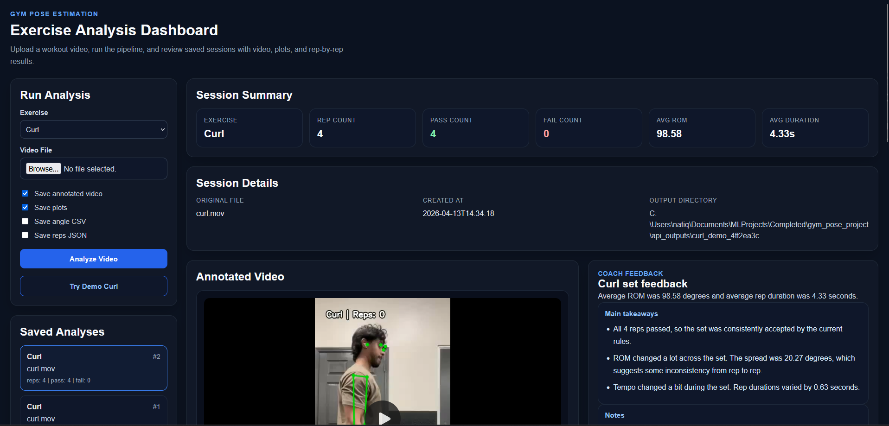
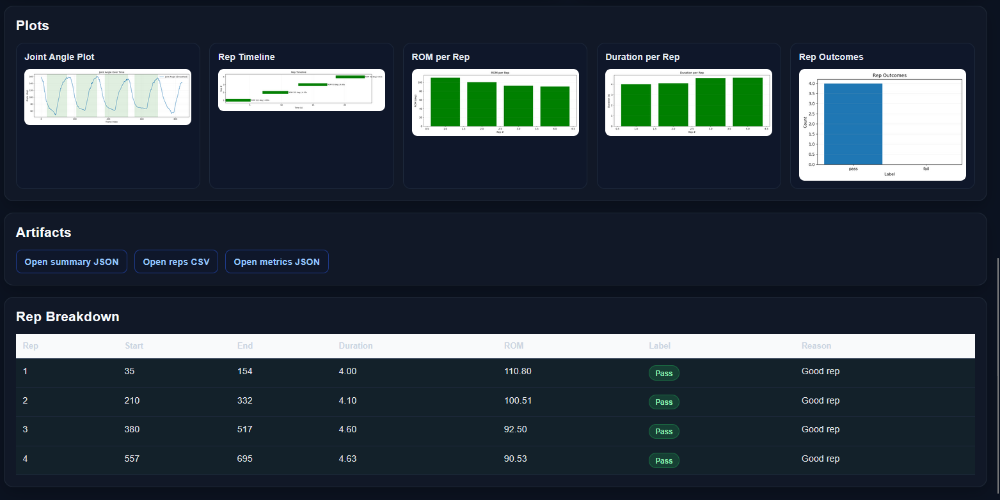
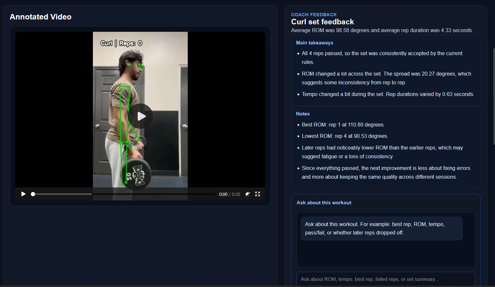
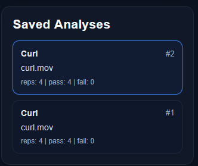

# Gym Pose Estimation Web App

A full-stack workout analysis app that uses computer vision to segment reps, evaluate form, and present the results through an interactive dashboard with visualizations and grounded AI coaching feedback.

**Tech Stack:** React, Vite, FastAPI, SQLite, Python, OpenCV, YOLOv8, Matplotlib


## Demo


## What the App Gives You

After running a video, the app gives you:

- rep count and pass/fail summary
- annotated video with real-time feedback
- per-rep breakdowns like range of motion, duration, and outcome
- plots that help you understand consistency across the set
- saved session history so past analyses can be reopened
- grounded AI coaching feedback based on the workout results


## Screenshots

### Dashboard
Upload controls, saved analyses, summary cards, and the main workout review experience.



### Analysis Results
Plots, artifact outputs, and rep-level breakdowns generated from a completed run.



### AI Coaching Feedback
Grounded coaching feedback and workout Q&A built on top of structured analysis results.



### Saved Session History
Previously completed sessions can be reopened and reviewed later.




## System Overview

The app is split into four main parts:

- **React frontend** for uploading videos, viewing results, and revisiting saved sessions
- **FastAPI backend** for handling requests, running the analysis pipeline, and serving generated outputs
- **Computer vision pipeline** built around YOLOv8 pose estimation, joint-angle signal construction, rep segmentation, and rule-based form evaluation
- **SQLite database** for storing past analyses, rep-level results, and artifact references


## How It Works

Each workout video goes through the same flow:

1. **Pose estimation** extracts body keypoints frame by frame using YOLOv8 pose
2. **Joint angle analysis** converts those keypoints into exercise-specific movement signals
3. **Rep segmentation** detects where each rep starts and ends from the angle curve
4. **Per-rep evaluation** checks things like range of motion, tempo, and control using configurable calibration thresholds
5. **Output generation** creates the annotated video, plots, rep table data, and structured result files
6. **Dashboard rendering** displays everything back through the web app and stores the session for later review

## AI Coaching Layer

On top of the computer vision pipeline, the app includes an AI coaching layer that turns structured workout results into readable feedback.

Instead of sending raw video directly to an LLM, the system first computes rep-level metrics such as ROM, duration, outcomes, and overall session trends. Those structured results are then used to generate short coaching feedback and support follow-up questions through the workout chat panel.

This keeps the AI layer grounded in actual analysis outputs rather than generic responses.


## Technical Highlights

- Built a full-stack workflow that connects a React frontend, FastAPI backend, SQLite storage layer, and a custom computer vision pipeline
- Used YOLOv8 pose estimation and joint-angle signal analysis to drive rep segmentation and form evaluation
- Supported configurable calibration profiles so rep strictness can be adjusted without changing code
- Generated multiple outputs from a single analysis run, including annotated video, per-rep plots, structured CSV/JSON artifacts, and rep breakdown tables
- Added persistent session history so completed analyses can be reopened and reviewed later
- Integrated an AI feedback layer that uses structured workout metrics to produce grounded coaching feedback


## Engineering Challenges

A few of the main problems this project had to solve:

- handling noisy pose keypoints across frames so rep logic stays stable
- segmenting reps from joint-angle motion signals instead of treating frames independently
- defining pass/fail logic in a way that is configurable across exercises and calibration profiles
- turning one analysis run into multiple interpretable outputs, including video, plots, tables, and saved artifacts
- grounding AI coaching feedback in measurable workout data instead of raw video alone
- storing completed analyses and restoring them cleanly through the dashboard


## How to Run

### 1. Start the backend

From the project root:

```bash
.venv_yolo\Scripts\activate
uvicorn api:app --reload
```

### 2. Start the frontend

Open a second terminal:

```bash
cd frontend
npm install
npm run dev
```

### 3. Open the app

Go to:

```text
http://localhost:5173
```

### 4. Run a demo analysis

Use the **Try Demo Curl** button or upload your own workout video to generate a new analysis.


## Notes / Limitations

- The system currently uses 2D pose estimation, so camera angle and visibility can affect accuracy
- Form evaluation is based on configurable rule thresholds rather than a learned classifier
- The current app is focused on curl, squat, and bench workflows
- The AI feedback layer is grounded in structured workout outputs, but it depends on the quality of the underlying analysis
